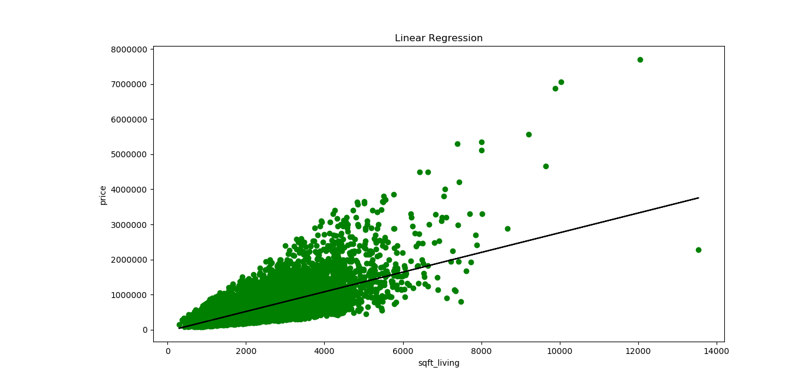

```text
usage: run.py [-h] [--load LOAD]

optional arguments:
  -h, --help   show this help message and exit
  --load LOAD  True: Load trained model False: Train model default: True
```

### Train the model
```shell
python run.py
python run.py --load 1
```

### Load the weight model
```shell
python run.py --load 0
```
### Training process
```text
MSE 650965.7788663033
R^2 value: 0.49285321790379316
b_0: 280.6235678974482 
b_1: -43580.743094473844
Do you want to save the model weight? yes
Model saved at weights/LinReg-ymj3r.pkl
```




## Conclusion
```text
R squared value  is very low !!!
We're not able to find linear relationship between the size and price of the house 
```